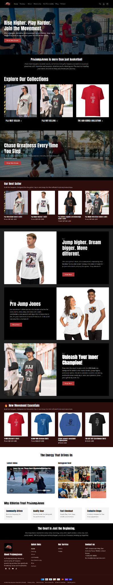

# ProJumpJones — Shopify Store Design

A basketball-focused Shopify print-on-demand storefront designed around sports apparel, branded merchandise, product discovery, and a bold athletic visual identity.

## Project Preview

## Project Overview

This portfolio project showcases a full-page Shopify storefront concept for ProJumpJones, a basketball-inspired apparel and merchandise brand.

The homepage combines strong sports imagery, product merchandising, promotional content, collection discovery, brand storytelling, and clear calls to action to create an engaging e-commerce experience.

## Key Features

- Custom Shopify storefront design
- Basketball-focused brand presentation
- Print-on-demand e-commerce structure
- Promotional hero section
- Featured product merchandising
- Product collection navigation
- Sports apparel and merchandise presentation
- Brand storytelling sections
- Promotional campaign sections
- Customer-focused calls to action
- Social/lifestyle content integration
- Newsletter and footer navigation
- Responsive e-commerce layout
- Conversion-focused homepage structure

## Design & UX Highlights

### Bold Athletic Identity
The storefront uses basketball-focused imagery, strong typography, and energetic visual sections to establish a distinctive sports brand identity.

### Product-Led Merchandising
Featured products and collections are integrated throughout the homepage to keep the shopping experience central while supporting the brand story.

### Print-on-Demand Positioning
The storefront structure is suited to a print-on-demand model, giving the brand room to showcase designs, apparel, and basketball-themed merchandise without overwhelming the visitor.

### Conversion-Focused Layout
Promotional sections, product discovery, brand messaging, and calls to action are arranged to guide visitors naturally from brand discovery toward shopping.

## Skills Demonstrated

`Shopify` `E-commerce Design` `Print-on-Demand` `Shopify Theme Customization` `Liquid` `HTML` `CSS` `Responsive Design` `UI/UX` `Conversion Optimization` `Product Merchandising`

## Project Type

**Shopify E-commerce Store / Basketball Apparel & Print-on-Demand**

## Portfolio Note

This repository is a visual portfolio showcase of the Shopify storefront design. The original live store URL is not included because it is not currently available.

## Disclaimer

This repository is intended to showcase design and development work for portfolio purposes. Product names, imagery, branding, and other visual assets shown in the preview belong to their respective owners where applicable.
